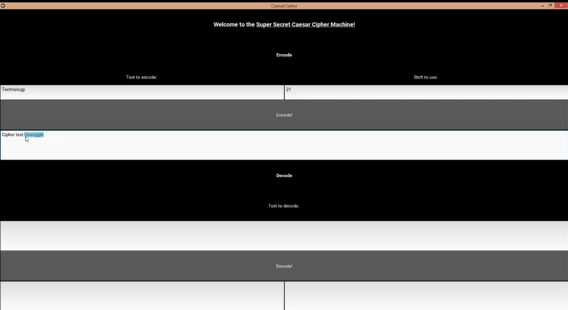
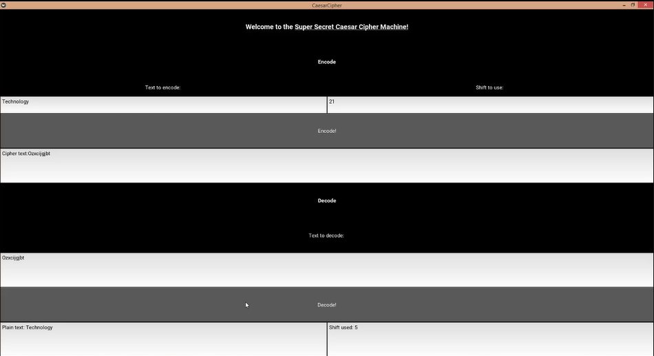

# caesar-cipher
A program that encodes and decodes using caesar cipher. 
The text-based user interface can be accessed my running main.py. 
The gui user interface can be accessed by running kivymain.py; note that this requires a working installation of kivy. 

 
